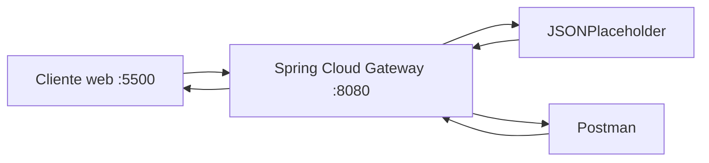

# Laboratorio 1 · API Gateway local con Spring Cloud Gateway

**Asignatura:** DSY1107 · Desarrollo Cloud Native I
**Integrante:** [tu nombre]
**Repositorio:** [link de tu repo]

## Objetivo

Comprender los conceptos fundamentales de un API Gateway (routing, versionado,
políticas transversales y CORS) mediante configuración declarativa, usando
Spring Cloud Gateway Server WebMVC como implementación de referencia, sin
programar lógica de negocio ni un backend propio.

## Arquitectura



- **Cliente web (`:5500`)**: usado específicamente para comprobar CORS desde
  navegador, ya que los navegadores sí aplican la Same-Origin Policy.
- **Postman**: usado para probar todos los métodos HTTP (GET, POST, PUT,
  DELETE) directo contra el gateway. No aplica CORS, por eso funciona incluso
  sin configurarlo.
- **Spring Cloud Gateway (`:8080`)**: punto de entrada único. Recibe todas las
  peticiones, decide con `predicates` a qué route corresponden, transforma la
  URL con `RewritePath`, agrega headers propios (`X-Api-Version`,
  `X-Gateway-Lab`) y reenvía al backend real.
- **JSONPlaceholder**: backend de prueba público. Resuelve la operación
  (simulada) de negocio y no tiene conocimiento de que existe un gateway
  delante.

## Requisitos

- JDK 21+
- Maven 3.9+
- Git
- Postman
- Navegador con DevTools

## Cómo ejecutar

```bash
cd gateway
mvn spring-boot:run
```

El gateway queda escuchando en `http://localhost:8080`.

Para probar CORS desde navegador, sirve `client/index.html` en
`http://localhost:5500` (por ejemplo con la extensión Live Server de VS Code,
**accediendo explícitamente por `localhost`, no por `127.0.0.1`**, ya que para
CORS son orígenes distintos).

## Rutas configuradas

| id | predicate | uri destino | filtros |
|---|---|---|---|
| `posts-v1` | `Path=/api/v1/posts/**` | `https://jsonplaceholder.typicode.com` | `RewritePath`, `AddResponseHeader=X-Api-Version,v1`, `AddResponseHeader=X-Gateway-Lab,DSY1107` |
| `posts-v2` | `Path=/api/v2/posts/**` | `https://jsonplaceholder.typicode.com` | `RewritePath`, `AddResponseHeader=X-Api-Version,v2`, `AddResponseHeader=X-Gateway-Lab,DSY1107` |

Ambas routes apuntan al mismo backend físico; lo único que cambia entre v1 y
v2 es el contrato observado por el cliente (la URL y el header de versión),
no la infraestructura real detrás.

## Pruebas HTTP realizadas

| Método | Endpoint | Status | Resultado |
|---|---|---:|---|
| GET | `/api/v1/posts` | 200 | Colección de posts |
| GET | `/api/v1/posts/1` | 200 | Recurso individual |
| POST | `/api/v1/posts` | 201 | Creación simulada (no persiste) |
| PUT | `/api/v1/posts/1` | 200 | Actualización simulada (no persiste) |
| DELETE | `/api/v1/posts/1` | 200 | Eliminación simulada, body vacío |

Detalle completo, con bodies enviados, en `docs/evidencias.md`.

## Richardson Maturity Model — Nivel 2

La API cumple nivel 2 porque expone **recursos identificables** por URL
(`/posts`, `/posts/1`), usa **métodos HTTP con significado real** (GET para
leer, POST para crear, PUT para actualizar, DELETE para eliminar) y devuelve
**status codes semánticos** (`200` para lecturas/actualizaciones exitosas,
`201` para creación), en vez de responder siempre `200` sin distinción.

## Versionado

Se mantienen `/api/v1` y `/api/v2` simultáneamente para no romper a clientes
que ya integraron v1 mientras otros migran a v2. Ambas versiones apuntan hoy
al mismo backend; versionar el contrato público (la URL/API que ve el
cliente) no implica necesariamente versionar el servidor desplegado. Una
versión se retiraría cuando ya no queden consumidores activos usándola, tras
un período de aviso (deprecation).

## CORS

Con `lab.cors.enabled: false`, las peticiones desde el navegador funcionan,
porque JSONPlaceholder ya refleja automáticamente el header
`Access-Control-Allow-Origin` con el origen del cliente que lo consulta.

Al activar `lab.cors.enabled: true` (que habilita `LabCorsConfiguration`), las
peticiones GET reales quedaron **bloqueadas por el navegador**, porque la
respuesta terminaba con el header `Access-Control-Allow-Origin` **duplicado**:
uno agregado por JSONPlaceholder y otro por la configuración propia del
gateway. La especificación CORS no permite valores repetidos de ese header, y
el navegador rechaza la respuesta completa aunque el status HTTP sea `200`.

El **preflight OPTIONS**, en cambio, sí funcionó correctamente con CORS
activado (`200 OK`, con `Access-Control-Allow-Origin` y
`Access-Control-Allow-Methods` correctos y sin duplicar), porque Spring lo
responde directamente sin reenviarlo al backend — nunca llega a
JSONPlaceholder, así que no hay oportunidad de que se agregue un segundo
header.

Evidencia completa (capturas, headers, preguntas respondidas) en
`docs/evidencias.md`, sección 7.

## Responsabilidades: Cliente vs Gateway vs Backend

| Responsabilidad | Cliente | Gateway | Backend |
|---|:---:|:---:|:---:|
| Routing | | ✔️ | |
| Lógica de negocio | | | ✔️ |
| Autenticación/autorización | | ✔️ | ✔️ |
| Transformación de rutas | | ✔️ | |
| Persistencia | | | ✔️ |
| Rate limiting | | ✔️ | |
| Reglas de negocio | | | ✔️ |
| Observabilidad | | ✔️ | |

Justificación detallada en `docs/evidencias.md`, sección 9.

## Problemas encontrados

1. `default-filters` no aplicaba el header transversal — es un concepto
   exclusivo de la variante reactiva de Spring Cloud Gateway, no soportado en
   Server WebMVC. Solución: agregar el filtro a cada route individualmente.
2. `403 Forbidden` al probar CORS con Live Server — causado por
   `127.0.0.1:5500` vs `localhost:5500`, orígenes distintos para el navegador.
   Solución: acceder explícitamente por `localhost`.
3. Header `Access-Control-Allow-Origin` duplicado al activar CORS — causado
   por JSONPlaceholder agregando su propio header además del que agrega el
   gateway. Documentado como limitación del backend de prueba usado.

Detalle completo en `docs/evidencias.md`, sección 10.

## Conclusiones

El gateway resolvió el acoplamiento directo entre cliente y backend: el
cliente solo necesita conocer `localhost:8080`, sin saber nunca la dirección
real de JSONPlaceholder. Además centralizó el versionado y las políticas
transversales sin modificar el backend.

Los conceptos trabajados (predicate, integration/uri, transformación de
rutas, CORS) son equivalentes a los que existen en Amazon API Gateway,
independientemente de la tecnología usada para implementarlos. También se
aprendió que un API Gateway no reemplaza la validación cuidadosa de
comportamientos reales de infraestructura: la teoría de CORS no siempre
coincide con cómo responden los backends reales en producción.

## Colaboración GitHub

Ver tabla en `docs/evidencias.md`, sección 11.

## Evidencias

Evidencia completa (capturas, headers, respuestas a preguntas conceptuales)
en [`docs/evidencias.md`](./docs/evidencias.md).