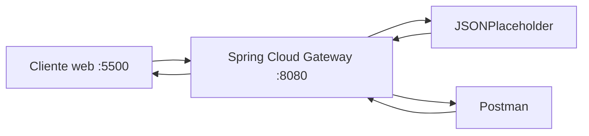

# Evidencias · Laboratorio API Gateway

## Integrantes
- Nombre:
- Nombre:
- Nombre:

## 1. Backend directo

Antes de utilizar el gateway, registrar las pruebas directas contra JSONPlaceholder.

| Método | URL | Status | Observación |
|---|---|---:|---|
| GET | `https://jsonplaceholder.typicode.com/posts` | 200 | body normal |
| GET | `https://jsonplaceholder.typicode.com/posts/1` | 200 | body normal |

**¿Qué información del backend conoce el cliente en este escenario?**

Respuesta: conoce directamente la dirección real del backend: el dominio completo https://jsonplaceholder.typicode.com
y su estructura de rutas (/posts, /posts/1).

---

## 2. Arquitectura final



Explicar brevemente qué responsabilidad cumple cada componente.

- **Cliente web (:5500)**: interfaz en el navegador usada específicamente para comprobar el 
  comportamiento de CORS. Envía peticiones al gateway sin conocer la dirección real del backend.

- **Postman**: cliente usado para probar todos los métodos HTTP (GET, POST, PUT, DELETE) 
  directamente contra el gateway. A diferencia del navegador, no aplica la política CORS, 
  por eso puede funcionar incluso antes de configurar CORS.

- **Spring Cloud Gateway (:8080)**: punto de entrada único de la arquitectura. Recibe todas 
  las peticiones (tanto de Postman como del cliente web), decide mediante predicates a qué 
  ruta corresponden, transforma la URL con RewritePath, agrega headers transversales 
  (X-Gateway-Lab, X-API-Version) y reenvía la petición al backend real. También es responsable 
  de aplicar la política CORS antes de responder al navegador.

- **JSONPlaceholder**: backend de prueba. Resuelve la lógica real (o simulada) de negocio: 
  devuelve, crea, actualiza o elimina recursos. No tiene conocimiento de que existe un gateway 
  delante — solo responde a las peticiones que le llegan, ya transformadas.

---

## 3. Pruebas HTTP mediante gateway

| Método | URL | Status | Headers relevantes | Interpretación |
|---|---|---:|---|---|
| GET | `/api/v1/posts` | 200 | | colección |
| GET | `/api/v1/posts/1` | 200 | | recurso individual |
| POST | `/api/v1/posts` | 201 | | creación simulada |
| PUT | `/api/v1/posts/1` | 200 | | actualización simulada |
| DELETE | `/api/v1/posts/1` | 200 | | eliminación simulada |

Para POST y PUT incluir también el body enviado.

{
  "title": "Cloud Native",
  "body": "Laboratorio API Gateway",
  "userId": 1
}

{
  "id": 1,
  "title": "Cloud Native actualizado",
  "body": "Prueba PUT mediante gateway",
  "userId": 1
}

---

## 4. Routing

- URL solicitada por el cliente: http://localhost:8080/api/v1/posts
- `id` de la route: posts-v1
- predicate que hizo match: Path=/api/v1/posts/**
- URI/integration configurada: https://jsonplaceholder.typicode.com
- path recibido finalmente por el backend: /posts
- función de `RewritePath`: elimina el prefijo /api/v1 de la URL antes de reenviarla al backend, para que coincida con las rutas reales que expone JSONPlaceholder (que no usa ese prefijo)

### Recorrido de una petición

Explicar con sus palabras:

```text
cliente → gateway → backend → gateway → cliente
```
Cuando se manda la petición desde Postman a localhost:8080/api/v1/posts, yo como cliente
no sé ni me importa dónde está realmente JSONPlaceholder. El gateway es el que recibe
esa petición primero. Revisa sus routes configuradas y ve que /api/v1/posts/** hace
match con el predicate de la route posts-v1. Antes de mandar la petición al backend,
el filtro RewritePath le saca el /api/v1 a la URL, dejando solo /posts, porque esa es
la ruta que realmente existe en JSONPlaceholder (ellos no tienen /api/v1, tienen /posts
directamente). Con esa URL ya transformada, el gateway hace la petición real hacia
https://jsonplaceholder.typicode.com/posts, recibe la respuesta del backend, y me la
devuelve tal cual a mí. Yo nunca hablé directo con JSONPlaceholder, todo pasó por el
gateway.
---

## 5. Versionado

- Evidencia `/api/v1`: GET http://localhost:8080/api/v1/posts/1 -> 200 OK
- Header `X-API-Version` observado: v1
- Evidencia `/api/v2`: GET http://localhost:8080/api/v2/posts/1 -> 200 OK
- Header `X-API-Version` observado: v2

Responder:

1. ¿Por qué mantener v1 y v2 simultáneamente? 
Para no romper los clientes que usan v1 y aun no migran hacian v2
2. ¿Qué consumidores podrían seguir usando v1?
apps que no necesiten el uso de las nuevas funciones de la v2
3. ¿Cuándo retirarían una versión? 
cuando ya no quede ningun cliente usandola, tras un periodo de aviso
4. ¿Versionar el contrato público es lo mismo que versionar el servidor desplegado?
No - en este laboratorio, v1 y v2 apunta al mismo backend. Solo cambia el "contrato" que ve el cliente (la URL y el header), no el backend
---

## 6. Header transversal

- Header esperado: `X-Gateway-Lab: DSY1107`
- Evidencia observada: aparece en las respuestas de /api/v1/posts/1 y /api/v2/posts/1
- ¿Por qué este comportamiento puede considerarse transversal?: Porque no depende de la logica de negocio de una route especifica, sino que es una politica aplicada por el gateway a cualquier petición que pase por él, sin importar la version o el recurso.

---

## 7. CORS

### Antes de configurar CORS

- URL del cliente web: `http://localhost:5500`
- Endpoint consultado:
- Resultado visible:
- Mensaje relevante en Console/Network:

### Después de configurar CORS

- Resultado visible:
- `Access-Control-Allow-Origin`:
- `Access-Control-Allow-Methods`:

### Preflight OPTIONS

- Request utilizado:
- Status:
- Headers relevantes:

Responder:

1. ¿Por qué Postman puede funcionar cuando el navegador falla?
2. ¿Qué es un preflight?
3. ¿CORS autentica o autoriza usuarios?
4. ¿Qué riesgo tendría permitir cualquier origen sin analizar el contexto?

---

## 8. Richardson Maturity Model nivel 2

Explicar qué elementos observados en el laboratorio permiten afirmar que la API utiliza recursos, métodos HTTP y status codes con semántica HTTP.

---

## 9. Responsabilidades

| Responsabilidad | Cliente | Gateway | Backend | Justificación |
|---|:---:|:---:|:---:|---|
| routing | | | | |
| lógica de negocio | | | | |
| autenticación/autorización | | | | |
| transformación de rutas | | | | |
| persistencia | | | | |
| rate limiting | | | | |
| reglas de negocio | | | | |
| observabilidad | | | | |

---

## 10. Problemas encontrados

1. Problema:
   - causa:
   - solución:

---

## 11. Colaboración GitHub

| Integrante | Rama | Pull Request | Aporte principal |
|---|---|---|---|
| | | | |

Agregar enlaces a los Pull Requests.

---

## 12. Conclusiones

- ¿Qué problema resolvió el gateway?
- ¿Qué concepto del laboratorio sería equivalente al trabajar posteriormente con Amazon API Gateway?
- ¿Qué aprendió el grupo que no depende específicamente de Spring Cloud Gateway?
